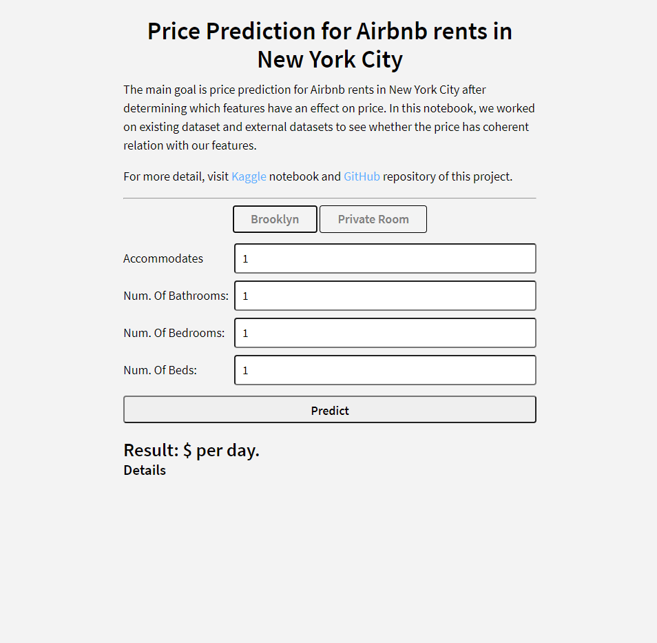

# airbnb-price-prediction

https://airbnb-prediction-app.herokuapp.com/

Price prediciton web-app for Airbnb in New York City.

The project was started as Google Colab notebook. Then, the project is deployed on the web. The main goal is price prediction for Airbnb rents in New York City after determining which features have an effect on price. 

### Data:
- [NYC Transit Subway Entrance and Exit Data](https://data.ny.gov/Transportation/NYC-Transit-Subway-Entrance-And-Exit-Data/i9wp-a4ja/data)
- [Airbnb - Listings](https://data.ny.gov/Transportation/NYC-Transit-Subway-Entrance-And-Exit-Data/i9wp-a4ja/data)
- [New York City Airbnb Open Data](https://www.kaggle.com/dgomonov/new-york-city-airbnb-open-data)

### Screenshots:

  
   
  
  

### Authors:
- [Hasan Ocak](https://github.com/ocakhasan)
- [Burak Sekili](https://github.com/buraksekili)
